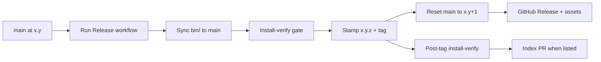

# Development & Advanced Usage Guidelines

This document contains instructions for building the bridge from source, running the alternative Python-based MCP server, and using the direct command-line test utility.

---

## 1. Building the Rust MCP Server from Source

If you want to compile the self-contained Rust binary yourself (instead of using the precompiled ones in `bin/`):

1. Ensure you have Rust and Cargo installed.
2. Navigate to the Rust directory:
   ```bash
   cd rust_mcp_server
   ```
3. Build the release binary:
   ```bash
   cargo build --release
   ```
4. The compiled executable will be located at:
   `rust_mcp_server/target/release/freecad-mcp-bridge.exe` (or `freecad-mcp-bridge` on Unix).

---

## Qt imports

Code loaded inside FreeCAD (`freecad/mcp_bridge/init_gui.py`, `freecad/mcp_bridge/bridge.py`) uses FreeCAD's `PySide` shim (`PySide.QtCore`, `PySide.QtNetwork`, etc.), which maps to the Qt binding bundled with your FreeCAD install.

The out-of-process helpers below (`freecad_mcp_server.py`, `send_cmd.py`) run in a normal Python environment and use standalone `PySide6` instead.

## Icons

The addon uses a single **SVG** icon at `Resources/Icons/icon.svg` (repo root). That is sufficient for Windows, Linux, and macOS:

* FreeCAD and Qt load SVG via QtSvg on all platforms (no separate `.ico` or `.png` required).
* `package.xml` references the icon with forward slashes; FreeCAD normalizes paths per OS.
* The same file is used for Addon Manager listing and the in-app toolbar/command.

---

## Releases

### The big rule: never create release tags manually

**Release tags are created only by the Release workflow** (`.github/workflows/release.yml`). Maintainers must not run `git tag` locally or create tags through the GitHub UI.

| Do | Don't |
|----|-------|
| Keep `main` at two-part `x.y` in `package.xml`, push, then run **Release** once | Create release tags by hand or edit stamped `x.y.z` versions |
| Let Release sync `bin/`, verify, stamp, tag, and reset `main` to `x.(y+1)` | Re-run **Release** for a tag that already exists (workflow fails) |
| Use **Release install verify** (`workflow_dispatch`) to test CI while developing on `main` | Expect install-verify alone to create or move tags |

**Why:** Each release tag must be a complete, installable snapshot — Python sources, `package.xml`, and prebuilt `bin/` clients — with `bin/` committed to `main` *before* the tag is applied. Tags created before this process (before **v0.1.11**) pointed at commits missing synced binaries and are **not** suitable as FreeCAD Index `git_ref` values.

**v0.1.11** is the first complete tag in this model.

### Branches, tags, and the Index

* **`main`** is the development branch. It may be ahead of the latest shipped release.
* **Version tags** (`v0.1.11`, etc.) are the authoritative install snapshots.
* This project uses **[Alternative 1: Tagged Releases](https://freecad.github.io/Addon-Academy/Guides/Publishing/Indexed)** for the [FreeCAD Addon Index](https://github.com/FreeCAD/Addons): the Index pins a specific tag via `git_ref`, not rolling `main`.
* First listing request: [FreeCAD/Addons #70](https://github.com/FreeCAD/Addons/issues/70) (open as of 2026-06-23).

### Version format (`package.xml`)

| Ref | `<version>` | Meaning |
|-----|-------------|---------|
| **`main` (development)** | `x.y` (two-part) | Development line — no commit fingerprint in the manifest |
| **Tagged release** | `x.y.z` where `z` = short SHA of the stamp commit | Stamped only after verify passes; **tag === version** (e.g. `v0.2.a1b2c3d`) |

Do not hand-edit a stamped `x.y.z` on `main`. The publish orchestrator resets `main` to `x.(y+1)` after tagging.

**Fixed-point note:** embedding the stamp commit’s own short SHA inside its `package.xml` is a git fixed-point problem (the hash depends on the file contents). The internal orchestrator tries a `git commit-tree` convergence loop; if it fails, release publish aborts. This applies on any branch — not something a `releases` branch avoids.

### End-to-end release pipeline



**Release workflow order** (`.github/workflows/release.yml`):

1. Build Rust MCP binaries (Linux, macOS, Windows) in parallel.
2. **Prepare** — download artifacts, install into `bin/`, require two-part `x.y` in `package.xml`, commit `bin/` to `main` if changed, **push `main`**.
3. **Install verify (hard gate)** — full Addon Manager install + restart verify on all three OSes against `main` (`install_mode: main`, expects `x.y`). **No tag if this fails.**
4. **Publish (atomic orchestrator)** — `scripts/release-publish-orchestrator.sh` only, with `RELEASE_PUBLISH_AUTHORIZED=true` from the workflow. In one guarded pass: stamp-only commit (`package.xml` only) → annotated tag → reset-only commit (`main` → `x.(y+1)`) → push tag and `main` → GitHub Release assets.

There is **no** standalone stamp script. Stamp, tag, and reset cannot be invoked separately.

Pushing the release tag still triggers `release-install-verify.yml` as a post-release check (`install_mode: tag`).

If Rust sources did not change, the prepare commit step may be a no-op, but verify and publish still run against current `main`.

### `bin/` layout (shipped with the addon)

| Path | Platform |
|------|----------|
| `bin/win32/freecad-mcp-bridge.exe` | Windows |
| `bin/linux/freecad-mcp-bridge` | Linux x86_64 |
| `bin/macos/freecad-mcp-bridge` | macOS x86_64 |

### Publishing a release (maintainer checklist)

1. Merge finished work into `main` (topic branches for larger changes).
2. Ensure `package.xml` on `main` is the intended two-part development line (`x.y`); commit and push.
3. GitHub → **Actions** → **Release** → **Run workflow** (branch: **`main`** only).
4. Wait for **Release install verify** to run automatically on the new `v*` tag (or dispatch it manually against the tag while iterating).
5. When listed in the Index, update the Addons entry (see below).

Do not reuse a version number. Do not re-run Release for an existing tag (e.g. **v0.1.11**).

### FreeCAD Addon Index

Guides: [Publishing (Indexed)](https://freecad.github.io/Addon-Academy/Guides/Publishing/Indexed), [Updating](https://freecad.github.io/Addon-Academy/Guides/Maintaining/Updating), [Index Qualities](https://freecad.github.io/Addon-Academy/Topics/Addon-Index/Index/Qualities.html).

#### First listing

1. Ensure a complete tag exists (Release workflow).
2. Open an issue on [FreeCAD/Addons](https://github.com/FreeCAD/Addons) (label **Addon - Addition**) — see [#70](https://github.com/FreeCAD/Addons/issues/70).
3. Maintainers review against Index Qualities; they may ask for a proper tagged release if the ref is incomplete.
4. Entry is added to `Data/Index.json` (maintainer or contributor PR).

#### Updating after a new release

1. Run Release workflow → new `v{version}` tag.
2. Confirm install-verify passes on that tag.
3. Open a PR on [FreeCAD/Addons](https://github.com/FreeCAD/Addons) updating your entry's `git_ref`, `zip_url`, and `branch_display_name`.

Helper — prints the three Index fields for a version:

```bash
bash scripts/bump-index.sh 0.1.11
```

Index cache refresh can take up to **four hours** after the PR merges.

### Automated install verification (CI)

See **[TESTING.md](TESTING.md)** for the full CI architecture: workflow triggers, install vs verify phases, `ci_run_freecad.sh`, CI log format, and GitHub annotation behavior.

Summary: `.github/workflows/release-install-verify.yml` runs `test_install.py` and `test_verify.py` in **two separate FreeCAD processes** per OS (bash launcher on all platforms). Triggers: `workflow_dispatch` (pick tag and `tag` / `index_zip` mode) or push of a `v*` tag.

---

## 2. Alternative Python-Based MCP Server

If you prefer to run the MCP server using Python rather than the compiled binary:

1. Install Python 3.9+ and the required dependencies globally on your host environment:
   ```bash
   python -m pip install PySide6 mcp
   ```
2. Add this entry to your editor's `mcpServers` configuration (e.g. `claude_desktop_config.json`):
   ```json
   {
     "mcpServers": {
       "freecad-bridge": {
         "command": "python",
         "args": [
           "C:\\Users\\<YourUsername>\\AppData\\Roaming\\FreeCAD\\Mod\\freecad-mcp-bridge\\freecad_mcp_server.py"
         ]
       }
     }
   }
   ```

---

## 3. Direct CLI Testing Utility (`send_cmd.py`)

The `send_cmd.py` script is an optional command-line utility. It connects directly to the FreeCAD bridge socket (bypassing the MCP server) to execute Python code. It is useful for testing connection status independently.

*Requires `PySide6` installed globally on your host terminal environment (`python -m pip install PySide6`).*

**Run a code string to test the connection:**
```bash
python send_cmd.py "print('Hello from the terminal!')"
```

**Run a script file:**
```bash
python send_cmd.py -f path/to/your/script.py
```

---

## 4. Manual Macro (No-Install Alternative)

If you do not want to install any addon folders or global toolbars, you can run the bridge as a one-off macro:

1. Open FreeCAD.
2. Go to **Macro ➔ Macros... ➔ Create**.
3. Name it `RunBridge.FCMacro`.
4. Copy the entire contents of `freecad/mcp_bridge/bridge.py` from this project, paste it into the editor tab, and save (**Ctrl + S**).
5. Open the macro list and click **Run** on the window you want to control.
