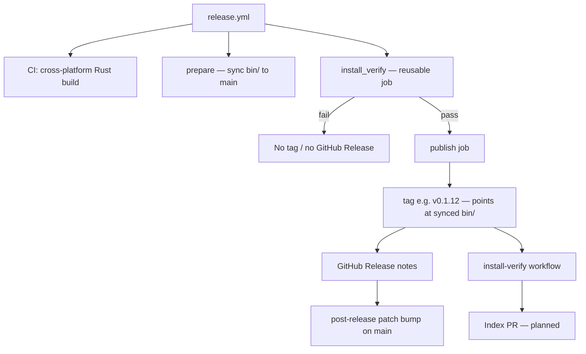
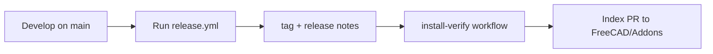

# Maintainer guide — releases & CI

Instructions for **maintainers of this repository** who cut releases and manage versioning.

Developers should read **[DEVELOPMENT.md](DEVELOPMENT.md)**. End users should read **[README.md](README.md)**.

For install-verify CI details (scripts, logs, triggers), see **[TESTING.md](TESTING.md)**.

### Terms

| Name | File | Role |
|------|------|------|
| **Release orchestrator workflow** | [`release.yml`](.github/workflows/release.yml) | Build → sync `bin/` → verify → tag → **GitHub Release** (notes) → post-release patch bump. Actions UI: **Release Orchestrator** → Run workflow. |
| **Install-verify workflow** | [`install-verify.yml`](.github/workflows/install-verify.yml) | Confirms addon installation works on Linux, macOS, and Windows. Can be run at any time; also runs automatically as a hard gate before tag in `release.yml`. Actions UI: **Install verify**. |
| **Version-bump workflow** | [`bump-package-version-on-push.yml`](.github/workflows/bump-package-version-on-push.yml) | Opt-in patch bump when commit message contains `[bump version]`. |

**Shorthand in this doc:** **release orchestrator** means `release.yml` only. Other names stay qualified (**install-verify workflow**, **version-bump workflow**). **`bin/` sync** (prepare) commits matching binaries to `main` *before* the tag; the tag zip and Index install use that tree. **GitHub Release** here means release notes only — not a second binary distribution path. *Internal only:* [`release-publish-orchestrator.sh`](scripts/release-publish-orchestrator.sh) and [`bump-package-z.sh`](scripts/bump-package-z.sh) inside the publish job. Avoid bare *workflow*, *orchestrator*, or *Release* when you mean a tool. Filenames are authoritative.

---

## Versioning at a glance

Versions are **`x.y.z`** everywhere — e.g. **`0.1.12`** in `package.xml` and `rust_mcp_server/Cargo.toml`.

| Part | In `0.1.12` | Who changes it |
|------|-------------|----------------|
| **`x.y`** (major.minor line) | `0.1` | Repo maintainers, rarely |
| **`z`** (patch) | `12` | GitHub Actions only |

**Tag === version:** shipping `0.1.12` creates tag **`v0.1.12`**. On shipping a release, GitHub Actions automatically bumps the patch on `main` (e.g. to `0.1.13`) for the next dev cycle.

**Patch, `<date>`, and `Cargo.toml` `version` are GitHub Actions-managed** — the **release orchestrator** (and optionally the **version-bump workflow**) update them. Edit **`x.y`** manually only when starting a new line (e.g. `0.1` → `0.2`).

---

## Release tags

**Index releases are tagged by the release orchestrator workflow** (`release.yml`). It gives FreeCAD Index maintainers a verified snapshot: `bin/` synced to `main`, install-verify green on three OSes, then tag (with release notes on GitHub). Manual tags are fine for experiments or other uses — only tags from **`release.yml`** should be proposed as `git_ref` values on [FreeCAD/Addons](https://github.com/FreeCAD/Addons).

| Do | Don't |
|----|-------|
| Run **`release.yml`** when shipping a version to the Index | Point the Index at a tag that skipped install-verify or lacks synced `bin/` |
| Merge to `main`, then run **`release.yml`** once when ready | Edit the patch number in `package.xml` by hand |
| Let the **release orchestrator** sync `bin/`, verify, tag (e.g. `v0.1.12`), and publish | Re-run **`release.yml`** for a tag that already exists (fails at prepare) |
| Use the **install-verify workflow** (`workflow_dispatch`) to test CI on `main` | Expect install-verify alone to create or move tags |

**Why Index cares:** The tag must point at a commit that already has synced `bin/` — Python sources, `package.xml`, and prebuilt clients in the repo tree (and in the tag zip). Prepare and verify run *before* the tag. Tags created before this process (before **v0.1.11**) pointed at commits missing synced binaries and are **not** suitable as `git_ref` values.

**v0.1.11** is the first complete tag in this model.

---

## Branches, tags, and the Index

* **`main`** is the development branch. It may be ahead of the latest shipped release.
* **Version tags** (`v0.1.11`, etc.) are the authoritative install snapshots.
* This project uses **[Alternative 1: Tagged Releases](https://freecad.github.io/Addon-Academy/Guides/Publishing/Indexed)** for the [FreeCAD Addon Index](https://github.com/FreeCAD/Addons): the Index pins a specific tag via `git_ref`, not rolling `main`.
* First listing request: [FreeCAD/Addons #70](https://github.com/FreeCAD/Addons/issues/70) (open as of 2026-06-23).

---

## When `package.xml` updates

| Field | Trigger | Mechanism |
|-------|---------|-----------|
| **Patch (post-release)** | After **`release.yml`** ships | Publish job bumps patch + `<date>` (and syncs `Cargo.toml`) |
| **Patch (opt-in)** | **`[bump version]`** in commit message | Version-bump workflow increments patch + `<date>` (and syncs `Cargo.toml`) |

Ordinary pushes do not change `package.xml`. Use `[bump version]` only when you deliberately want `main` on the next patch before shipping again (uncommon).

Index `git_ref` is the tag name (`v0.1.12`), matching `package.xml` by convention.

---

## The release orchestrator workflow (`release.yml`)

The **release orchestrator workflow** is what you run to ship a version. It owns build, verify gate, tagging, GitHub Release notes, and the post-release patch bump on `main`. There is no standalone tag path.

This is **not** the local `cargo build` described in [DEVELOPMENT.md](DEVELOPMENT.md). The `build` job below is a cross-platform CI matrix that produces `bin/` artifacts.



### End-to-end maintainer view



**`release.yml` job order:**

1. **CI build** — Rust MCP binaries (Linux, macOS, Windows) in parallel.
2. **Prepare** — download artifacts, install into `bin/`, read the version from `package.xml` (e.g. `0.1.12`), verify the tag does not already exist, commit `bin/` to `main` if changed, **push `main`**.
3. **Install-verify workflow** (pre-tag) — [`install-verify.yml`](.github/workflows/install-verify.yml) with `install_mode: main`: full Addon Manager install + restart verify on all three OSes against `main`. **No tag if this fails.**
4. **Publish job** — after verify passes: push the matching tag (e.g. `v0.1.12`) on the verified commit, create a **GitHub Release** for release notes (binaries stay in `bin/` on the tag — not uploaded separately), then bump the patch on `main` for the next dev cycle. Release publish uses internal [`release-publish-orchestrator.sh`](scripts/release-publish-orchestrator.sh) (`RELEASE_PUBLISH_AUTHORIZED=true`; not runnable standalone); post-release bump uses [`bump-package-z.sh`](scripts/bump-package-z.sh).

Publishing the release tag triggers **`install-verify.yml`** again as a post-ship check (`install_mode: tag`). That re-verify installs from the **tagged repo tree** (including `bin/`).

**Next shipped line:** `0.1.12` (Index listing request [#70](https://github.com/FreeCAD/Addons/issues/70) references `v0.1.11`). Re-running **`release.yml`** while `package.xml` still says `0.1.11` will fail at **prepare** — `v0.1.11` already exists.

If Rust sources did not change, the prepare commit step may be a no-op, but verify and publish still run against current `main`.

---

## `bin/` layout (shipped with the addon)

| Path | Platform |
|------|----------|
| `bin/win32/freecad-mcp-bridge.exe` | Windows |
| `bin/linux/freecad-mcp-bridge` | Linux x86_64 |
| `bin/macos/freecad-mcp-bridge` | macOS x86_64 |

---

## Shipping a release (checklist)

*In this section: **release orchestrator** = `release.yml`.*

1. Merge finished work into `main` (topic branches for larger changes).
2. Ensure `package.xml` on `main` is the version you intend to ship (e.g. `0.1.12`). Ordinary pushes do not advance the patch number; the **release orchestrator** bumps the patch after a successful ship.
3. GitHub → **Actions** → **Release Orchestrator** → **Run workflow** — runs **`release.yml`** (branch: **`main`** only).
4. Wait for the **install-verify workflow** on the new `v*` tag (runs automatically after the tag is pushed).
5. Open a PR on [FreeCAD/Addons](https://github.com/FreeCAD/Addons) to update the listing (see below).

**Duplicate versions are blocked.** **`release.yml`** reads `package.xml`, checks that `v{x.y.z}` does not already exist (**prepare**), and the **publish job** checks again before tagging. If the tag is already on GitHub, **`release.yml`** fails — no second tag, no partial publish. After shipping one version, the post-release patch bump on `main` moves you to the next line (e.g. `0.1.13`); run **`release.yml`** again only when that is the version you intend to ship.

---

## FreeCAD Addon Index

How **this repo's maintainers** request or update a listing. **Index maintainers** (the FreeCAD/Addons team) review and merge changes to `Data/Index.json` — a different role from maintaining this repository.

Guides: [Publishing (Indexed)](https://freecad.github.io/Addon-Academy/Guides/Publishing/Indexed), [Updating](https://freecad.github.io/Addon-Academy/Guides/Maintaining/Updating), [Index Qualities](https://freecad.github.io/Addon-Academy/Topics/Addon-Index/Index/Qualities.html).

### First listing

1. Ensure a complete tag exists (via **`release.yml`**).
2. Open an issue on [FreeCAD/Addons](https://github.com/FreeCAD/Addons) (label **Addon - Addition**) — see [#70](https://github.com/FreeCAD/Addons/issues/70).
3. Index maintainers review against Index Qualities; they may ask for a proper tagged release if the ref is incomplete.
4. Entry is added to `Data/Index.json` (their PR or yours on FreeCAD/Addons).

### Updating after shipping a release

1. Run **`release.yml`** → new `v{version}` tag.
2. Confirm post-tag install-verify passes on that tag.
3. Open a PR on [FreeCAD/Addons](https://github.com/FreeCAD/Addons) updating your entry's `git_ref`, `zip_url`, and `branch_display_name`.

Helper — prints the three Index fields for a version:

```bash
bash scripts/bump-index.sh 0.1.12
```

Index cache refresh can take up to **four hours** after the PR merges.

**Planned:** automate step 3 as a final publish-leg step (open or update the Index PR after a green ship). Not implemented yet — manual PR for now.

---

## Automated install verification (CI)

See **[TESTING.md](TESTING.md)** for the full CI architecture: triggers, install vs verify phases, `ci_run_freecad.sh`, CI log format, and GitHub annotation behavior.

Summary: **`install-verify.yml`** runs `test_install.py` and `test_verify.py` in **two separate FreeCAD processes** per OS (bash launcher on all platforms). See [TESTING.md](TESTING.md) for trigger and mode details.