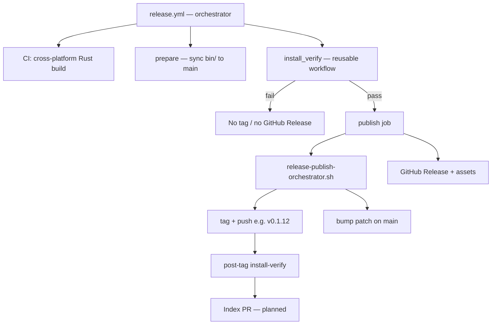
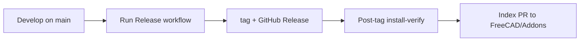

# Maintainer guide — releases & CI

Instructions for **project maintainers** who cut releases, manage versioning, and update the FreeCAD Addon Index.

Developers should read **[DEVELOPMENT.md](DEVELOPMENT.md)**. End users should read **[README.md](README.md)**.

For install-verify CI details (scripts, logs, workflow triggers), see **[TESTING.md](TESTING.md)**.

### Terms (disambiguation)

| Term | Meaning |
|------|---------|
| **Release workflow** | GitHub Actions workflow [`.github/workflows/release.yml`](.github/workflows/release.yml) — the automation you run from Actions (UI label: **Release**) |
| **Cutting / shipping a release** | The maintainer outcome: a verified `v*` tag, a **GitHub Release** page, and (optionally) an Index update |
| **GitHub Release** | The release page and uploaded assets on GitHub — not the workflow itself |
| **Publish orchestrator** | [`scripts/release-publish-orchestrator.sh`](scripts/release-publish-orchestrator.sh) — tags and post-release patch bump; runs only inside the Release workflow |
| **Release install verify workflow** | [`.github/workflows/release-install-verify.yml`](.github/workflows/release-install-verify.yml) — standalone or post-tag install test |

---

## Versioning at a glance

Versions are **`x.y.z`** everywhere — e.g. **`0.1.12`** in `package.xml` and `rust_mcp_server/Cargo.toml`.

| Part | In `0.1.12` | Who changes it |
|------|-------------|----------------|
| **`x.y`** (major.minor line) | `0.1` | Maintainers, rarely |
| **`z`** (patch) | `12` | GitHub Actions only |

**Tag === version:** shipping `0.1.12` creates tag **`v0.1.12`**. On cutting a release, GitHub Actions automatically bumps the patch on `main` (e.g. to `0.1.13`) for the next dev cycle.

**Patch, `<date>`, and `Cargo.toml` `version` are GitHub Actions-managed** — the push workflow and publish orchestrator automatically update them. Edit **`x.y`** manually only when starting a new line (e.g. `0.1` → `0.2`).

---

## Release tags

**Index releases are tagged automatically by the Release workflow** (`.github/workflows/release.yml`). That pipeline gives FreeCAD Index maintainers a verified snapshot: `bin/` synced to `main`, install-verify green on three OSes, then tag and a **GitHub Release**. Manual tags are fine for experiments or other uses — only **workflow-created** tags should be proposed as `git_ref` values on [FreeCAD/Addons](https://github.com/FreeCAD/Addons).

| Do | Don't |
|----|-------|
| Run the **Release workflow** when shipping a version to the Index | Point the Index at a tag that skipped install-verify or lacks synced `bin/` |
| Merge to `main`, then run the **Release workflow** once when ready | Edit the patch number in `package.xml` by hand |
| Let the **Release workflow** sync `bin/`, verify, tag (e.g. `v0.1.12`), and publish | Re-run the **Release workflow** for a tag that already exists (it fails at prepare) |
| Use the **Release install verify workflow** (`workflow_dispatch`) to test CI on `main` | Expect install-verify alone to create or move tags |

**Why Index cares:** Each indexed tag must be a complete, installable snapshot — Python sources, `package.xml`, and prebuilt `bin/` clients — with `bin/` committed to `main` *before* the tag is applied. Tags created before this process (before **v0.1.11**) pointed at commits missing synced binaries and are **not** suitable as `git_ref` values.

**v0.1.11** is the first complete tag in this model.

---

## Branches, tags, and the Index

* **`main`** is the development branch. It may be ahead of the latest shipped release.
* **Version tags** (`v0.1.11`, etc.) are the authoritative install snapshots.
* This project uses **[Alternative 1: Tagged Releases](https://freecad.github.io/Addon-Academy/Guides/Publishing/Indexed)** for the [FreeCAD Addon Index](https://github.com/FreeCAD/Addons): the Index pins a specific tag via `git_ref`, not rolling `main`.
* First listing request: [FreeCAD/Addons #70](https://github.com/FreeCAD/Addons/issues/70) (open as of 2026-06-23).

---

## When `package.xml` updates

| Field | Trigger | Mechanism |
|-------|---------|-----------|
| **`<date>`** | **Every push to `main`** | `.github/workflows/update-package-xml-on-push.yml` sets `<date>` to today (UTC) |
| **Patch (post-release)** | After the Release workflow tags | Publish orchestrator bumps patch + `<date>` (and syncs `Cargo.toml`) |
| **Patch (opt-in)** | **`[bump version]`** in commit message | Same push workflow increments patch + `<date>` (and syncs `Cargo.toml`) |

Ordinary pushes update `<date>` only. Use `[bump version]` only when you deliberately want `main` on the next patch before the next release (uncommon).

Index `git_ref` is the tag name (`v0.1.12`), matching `package.xml` by convention.

---

## The Release workflow

The **Release workflow** ([`release.yml`](.github/workflows/release.yml)) is what you run to ship a version. It owns build, verify gate, tag creation, and the **GitHub Release** page. The publish job delegates tagging and the post-release patch bump to the **publish orchestrator** (not runnable standalone).

This is **not** the local `cargo build` described in [DEVELOPMENT.md](DEVELOPMENT.md). The `build` job below is a cross-platform CI matrix that produces release `bin/` artifacts.



### End-to-end maintainer view



**Release workflow order** (`.github/workflows/release.yml`):

1. **CI build** — Rust MCP binaries (Linux, macOS, Windows) in parallel.
2. **Prepare** — download artifacts, install into `bin/`, read the version from `package.xml` (e.g. `0.1.12`), verify the tag does not already exist, commit `bin/` to `main` if changed, **push `main`**.
3. **Install verify (hard gate)** — full Addon Manager install + restart verify on all three OSes against `main` (`install_mode: main`). **No tag if this fails.**
4. **Publish orchestrator** — `release-publish-orchestrator.sh` only (`RELEASE_PUBLISH_AUTHORIZED=true`): create and push the matching tag (e.g. `v0.1.12`) on the verified commit, then bump the patch on `main` for the next dev cycle. The Release workflow then creates the **GitHub Release** and uploads assets.

There is no standalone tag script. Tag creation and post-release patch bump are one guarded pass.

Pushing the release tag still triggers `release-install-verify.yml` as a post-release check (`install_mode: tag`).

**Next shipped line:** `0.1.12` (Index listing request [#70](https://github.com/FreeCAD/Addons/issues/70) references `v0.1.11`). Re-running the **Release workflow** while `package.xml` still says `0.1.11` will fail at **prepare** — `v0.1.11` already exists.

If Rust sources did not change, the prepare commit step may be a no-op, but verify and publish still run against current `main`.

---

## `bin/` layout (shipped with the addon)

| Path | Platform |
|------|----------|
| `bin/win32/freecad-mcp-bridge.exe` | Windows |
| `bin/linux/freecad-mcp-bridge` | Linux x86_64 |
| `bin/macos/freecad-mcp-bridge` | macOS x86_64 |

---

## Shipping a release (checklist)

1. Merge finished work into `main` (topic branches for larger changes).
2. Ensure `package.xml` on `main` is the version you intend to ship (e.g. `0.1.12`). Ordinary pushes do not advance the patch number; the publish orchestrator bumps after a successful ship.
3. GitHub → **Actions** → **Release** workflow → **Run workflow** (branch: **`main`** only).
4. Wait for the **Release install verify workflow** on the new `v*` tag (runs automatically after the tag is pushed).
5. When listed in the Index, update the Addons entry (see below).

**Duplicate versions are blocked.** The **Release workflow** reads `package.xml`, checks that `v{x.y.z}` does not already exist (**prepare**), and checks again before tagging (**publish orchestrator**). If the tag is already on GitHub, the workflow fails — no second tag, no partial publish. After shipping one version, the post-release patch bump on `main` moves you to the next line (e.g. `0.1.13`); run the **Release workflow** again only when that is the version you intend to ship.

---

## FreeCAD Addon Index

Guides: [Publishing (Indexed)](https://freecad.github.io/Addon-Academy/Guides/Publishing/Indexed), [Updating](https://freecad.github.io/Addon-Academy/Guides/Maintaining/Updating), [Index Qualities](https://freecad.github.io/Addon-Academy/Topics/Addon-Index/Index/Qualities.html).

### First listing

1. Ensure a complete tag exists (via the Release workflow).
2. Open an issue on [FreeCAD/Addons](https://github.com/FreeCAD/Addons) (label **Addon - Addition**) — see [#70](https://github.com/FreeCAD/Addons/issues/70).
3. Maintainers review against Index Qualities; they may ask for a proper tagged release if the ref is incomplete.
4. Entry is added to `Data/Index.json` (maintainer or contributor PR).

### Updating after a new release

1. Run the **Release workflow** → new `v{version}` tag.
2. Confirm post-tag install-verify passes on that tag.
3. Open a PR on [FreeCAD/Addons](https://github.com/FreeCAD/Addons) updating your entry's `git_ref`, `zip_url`, and `branch_display_name`.

Helper — prints the three Index fields for a version:

```bash
bash scripts/bump-index.sh 0.1.12
```

Index cache refresh can take up to **four hours** after the PR merges.

**Planned:** automate step 3 as a final publish-leg step (open or update the Index PR after a green release). Not implemented yet — manual PR for now.

---

## Automated install verification (CI)

See **[TESTING.md](TESTING.md)** for the full CI architecture: workflow triggers, install vs verify phases, `ci_run_freecad.sh`, CI log format, and GitHub annotation behavior.

Summary: `.github/workflows/release-install-verify.yml` runs `test_install.py` and `test_verify.py` in **two separate FreeCAD processes** per OS (bash launcher on all platforms). Triggers: `workflow_dispatch` (pick tag and `tag` / `index_zip` / `main` mode) or push of a `v*` tag.