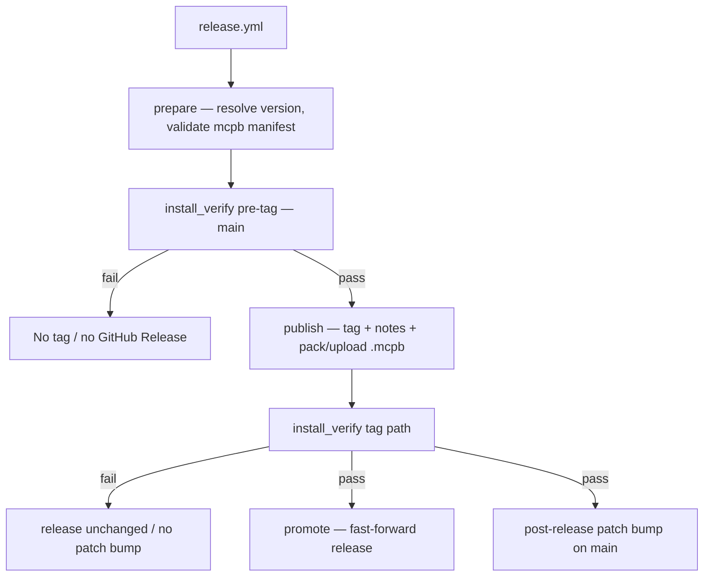

# Maintainer guide — releases & CI

Instructions for **maintainers of this repository** who cut releases and manage versioning.

Developers should read **[DEVELOPMENT.md](DEVELOPMENT.md)**. End users should read **[README.md](README.md)**.

For install-verify CI details (scripts, logs, triggers), see **[TESTING.md](TESTING.md)**.

---

## Versioning at a glance

The version number format is `x.y.z`; tags are named `v{x.y.z}` — e.g. shipping version `0.1.42` creates tag `v0.1.42`.

| Part | Meaning | Who changes it |
|------|---------|----------------|
| **`x.y`** (major.minor line) | e.g. `0.1` in `0.1.42` | Repo maintainers, manually, when starting a new line |
| **`z`** (patch) | e.g. `42` in `0.1.42` | GitHub Actions only, via `bump-package-z.sh` |

The version number is stored in `package.xml`, `manifest.json`, and `package.json` — kept in lockstep automatically by the bump process, which syncs the current version across all three whenever it runs, so none of them should ever need a manual edit just to match the others.

The bump runs once each new tag has passed its install-verify, pushing `main` ahead of the last shipped version — this is what keeps tag collisions rare, not continuous policing of `main` (which is expected to be unstable between releases; see [Branches, tags, and the FreeCAD Addon Index](#branches-tags-and-the-freecad-addon-index) below).

---

## Why these rules exist

- **Tags are permanent.** A tag names a fixed install source — once `v{x.y.z}` exists, its content must never change, or every install/reference pointing at it silently breaks.
- **Every component in a release carries the same version.** Matching numbers across `package.xml`, `manifest.json`, and `package.json` are what make "version X" mean one coherent thing, not a mismatched patchwork.
- **Version numbers only increase.** A newer version must always sort higher than an older one, or "is this an update" becomes unanswerable — for Addon Manager, for users, for anyone comparing releases.
- **The release pipeline is automated and gated, to help ensure the above.**
- **What we verify is what we tag.** The prepare job pins the release-candidate commit; publish refuses to tag if `main` has moved since; the tag is then re-verified by installing it, and only then does `release` move. The Addon Index listing, which follows `release`, can therefore never point at an untested snapshot.
- **`release` only moves forward.** Promote pushes without force, so GitHub refuses any move that isn't a fast-forward; what Index users already have is never rewritten.
- **The tag's zip is the tag.** GitHub archives the same tree the tag names, so the two install forms can never differ in content — only in install-layout mechanics. Verifying the zip form is about layout handling, never a second content gate.

---

## Release tags

**Releases** are created by the **release orchestrator workflow** (`release.yml`). It produces a verified snapshot: install-verify green on three OSes, then tag (with release notes on GitHub), then a second install-verify from the tag, then the **`release`** branch moves to that commit. Manual tags are fine for experiments or other uses; only **`release.yml`** moves `release`.

**FreeCAD Addon Index Qualities:** A listed `git_ref` must point at a complete, installable snapshot per the [FreeCAD Addon Index Qualities](https://freecad.github.io/Addon-Academy/Topics/Addon-Index/Index/Qualities.html) — Python sources and `package.xml`, nothing else required. The addon ships no prebuilt binaries at all; verify runs before the tag specifically to confirm the snapshot actually installs.

---

## Branches, tags, and the FreeCAD Addon Index

* **`main`** is the development branch. It may be ahead of the latest shipped release.
* **`release`** is the latest verified release. Only `release.yml` moves it, and only forward (a plain push, never forced), so undoing a bad release means shipping a new one.
* **Version tags** (`v{x.y.z}`) mark each release's commit, for history and the GitHub Release with its `.mcpb`.
* Listed on the [FreeCAD Addon Index](https://github.com/FreeCAD/Addons) as **`freecad-mcp-bridge`** with `git_ref` **`release`**: Index users follow `release`, and a release reaches them without an Index PR.

---

## When `package.xml` updates

| Field | Trigger | Mechanism |
|-------|---------|-----------|
| **Patch (post-release)** | After **`release.yml`** ships | Bump job increments patch + `<date>` (and syncs the shim's `manifest.json`/`package.json`) |
| **Patch (opt-in)** | Run **version-bump workflow** on `main` | Increments patch + `<date>` (and syncs the shim's `manifest.json`/`package.json`) |

Ordinary pushes do not change `package.xml`. Run **Bump package version** from Actions only when you deliberately want `main` on the next patch before shipping again (uncommon).

`package.xml`'s repository url names branch **`release`**: the Addon Manager installs that branch rather than the Index's `git_ref`, so the two must agree. **prepare** refuses to run otherwise. The Addon Manager offers an update when the `<version>` on `release` changes, which every release does.

---

### Workflows

| Name | File | Role |
|------|------|------|
| **Release orchestrator workflow** | [`release.yml`](.github/workflows/release.yml) | Ships a version; see the [job order](#the-release-orchestrator-workflow-releaseyml) below. Actions UI: **Release Orchestrator** → Run workflow. |
| **Install-verify workflow** | [`install-verify.yml`](.github/workflows/install-verify.yml) | Confirms addon installation works on Linux, macOS, and Windows. Can be run at any time; `release.yml` calls it before tag (`main`) and after (`tag` path). Actions UI: **Install verify**. |
| **Version-bump workflow** | [`bump-package-version.yml`](.github/workflows/bump-package-version.yml) | Actions UI: **Bump package version** → Run workflow. |

---

## The release orchestrator workflow (`release.yml`)

The **release orchestrator workflow** is what you run to ship a version. It owns validating the release candidate, the verify gate, tagging, GitHub Release notes (plus packing and uploading the `.mcpb` bundle), moving `release` to the verified commit, and the post-release patch bump on `main`. There is no standalone tag path.

```mermaid
flowchart TD
  R[release.yml]
  R --> prep[prepare — resolve version, validate mcpb manifest]
  prep --> verify[install_verify pre-tag — main]
  verify -->|fail| stop[No tag / no GitHub Release]
  verify -->|pass| pub[publish — tag + notes + pack/upload .mcpb]
  pub --> postverify[install_verify tag path]
  postverify -->|fail| stop2[release unchanged / no patch bump]
  postverify -->|pass| promote[promote — fast-forward release]
  postverify -->|pass| zbump[post-release patch bump on main]
```

**`release.yml` job order:**

1. **Prepare** — resolve the version from `package.xml`, verify the tag does not already exist, validate the Claude Desktop bundle manifest (`mcpb validate`), record the release-candidate commit SHA.
2. **Install-verify** (pre-tag) — [`install-verify.yml`](.github/workflows/install-verify.yml) with `install_mode: main`: full Addon Manager install + restart verify on all three OSes against `main`. **No tag if this fails.**
3. **Publish** — push the matching tag (`v{x.y.z}`) on the verified commit, create a **GitHub Release**, then pack the Claude Desktop bundle (`mcpb pack`) and upload it as a release asset. Uses [`release-publish-orchestrator.sh`](scripts/release-publish-orchestrator.sh) (`RELEASE_PUBLISH_AUTHORIZED=true`; not runnable standalone).
4. **Install-verify** (tag path) — same workflow with `install_mode: tag`: final sanity check that install works from the tag ref. **`release` doesn't move and no patch bump if this fails.**
5. **Promote** — push the verified commit to **`release`** as a plain push, which GitHub refuses unless it fast-forwards. This is the step that ships to Index users.
6. **Bump** — increment patch on `main` for the next dev cycle via [`bump-package-z.sh`](scripts/bump-package-z.sh), syncing the shim's `manifest.json`/`package.json` too. Runs in parallel with step 5.

Re-running **`release.yml`** while `package.xml` still names a tag that already exists on GitHub will fail at **prepare**.

---

## Release assets

Each GitHub Release carries one uploaded asset: **`freecad-mcp-bridge.mcpb`** — the packed Claude Desktop bundle, built from `mcp-stdio-shim/` via `mcpb pack` during the **publish** step. The addon itself isn't a release asset — it ships as plain Python source, installed directly from the repo tree (via the tag or its zip), not from anything attached to the release page.

---

## Shipping a release (checklist)

1. Merge finished work into `main` (topic branches for larger changes).
2. Ensure `package.xml` on `main` is the version you intend to ship. Ordinary pushes do not advance the patch number; the **release orchestrator** bumps the patch after a successful ship.
3. GitHub → **Actions** → **Release Orchestrator** → **Run workflow** — runs **`release.yml`** (branch: **`main`** only).
4. Wait for **`release.yml`** to finish (tag-path install-verify, **promote**, and patch bump). Index users get the release once the FreeCAD Addon Index cache refreshes, which can take up to **four hours**.

**Duplicate versions are blocked.** **`release.yml`** reads `package.xml`, checks that `v{x.y.z}` does not already exist (**prepare**), and **publish** checks again before tagging. If the tag is already on GitHub, **`release.yml`** fails — no second tag, no partial publish. After shipping, the post-release patch bump on `main` advances the patch; run **`release.yml`** again only when `package.xml` names the version you intend to ship next.

---

## FreeCAD Addon Index

How **this repo's maintainers** update the **`freecad-mcp-bridge`** listing on the FreeCAD Addon Index. **FreeCAD Addon Index maintainers** (the [FreeCAD/Addons](https://github.com/FreeCAD/Addons) team) review and merge changes to [`Data/Index.json`](https://github.com/FreeCAD/Addons/blob/master/Data/Index.json) on FreeCAD/Addons — not in this repository — a different maintainer role.

Guides: [Updating](https://freecad.github.io/Addon-Academy/Guides/Maintaining/Updating), [FreeCAD Addon Index Qualities](https://freecad.github.io/Addon-Academy/Topics/Addon-Index/Index/Qualities.html).

The entry lists `git_ref` **`release`** with `zip_url` `https://github.com/CREATeNG/freecad-mcp-bridge/archive/refs/heads/release.zip`. It changes only if the branch name does; releases need no Index PR.

The FreeCAD Addon Index cache refreshes from `release` periodically, which can take up to **four hours**.

---

## Automated install verification (CI)

See **[TESTING.md](TESTING.md)** for the full CI architecture: triggers, install vs verify phases, `ci_run_freecad.sh`, CI log format, and GitHub annotation behavior.

Summary: **`install-verify.yml`** runs `test_install.py` and `test_verify.py` in **two separate FreeCAD processes** per OS (bash launcher on all platforms). See [TESTING.md](TESTING.md) for trigger and mode details.